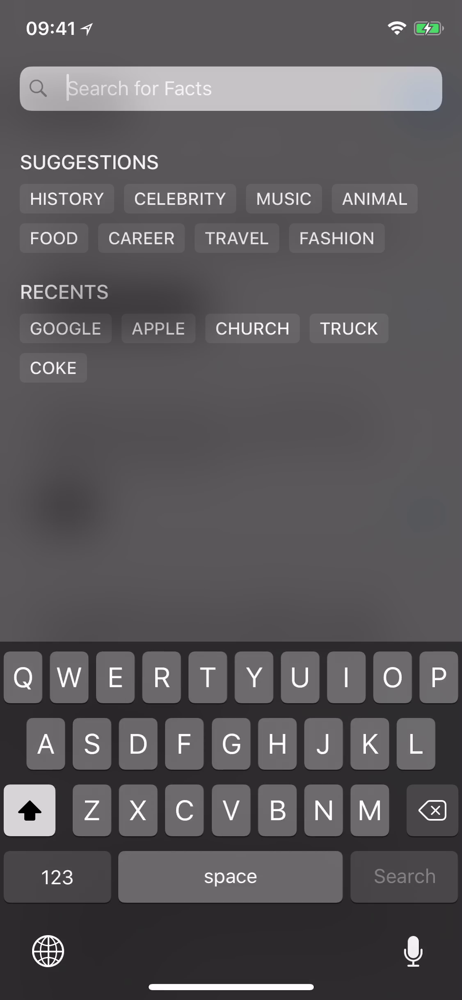
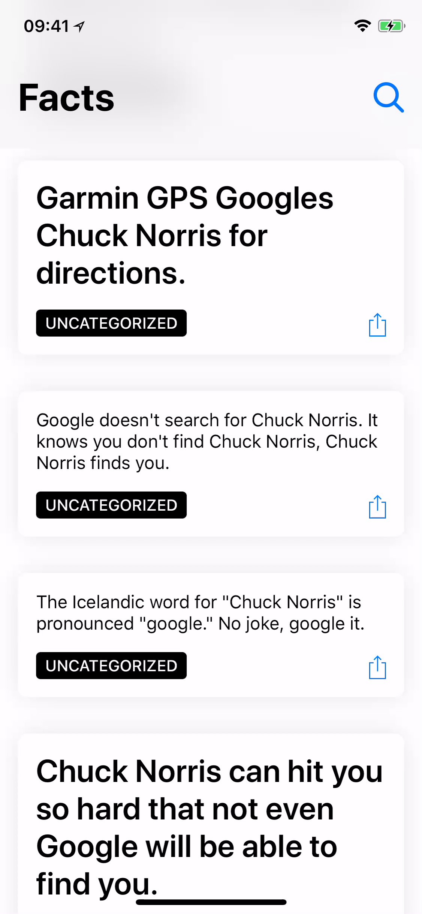
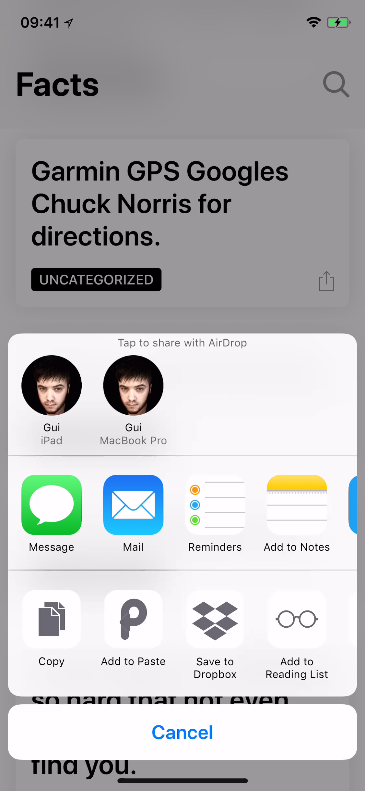

# Chuck

Browse [Chuck Norris Facts](https://api.chucknorris.io/) on your iPhone.

### Start by doing a search for your favorite keywords or using one of the suggested topics. To search, tap the search button or pull down on the main screen.



### All facts are saved to your library and every time you launch the app, a different selection of random facts shows up, even when you're not on-line.



### See a really cool fact you like? You can share it with your friends, just tap and hold or tap the share button.



# Nerdy bits 🤓

The app is written in Swift. It uses the following 3rd party libraries:

- RxSwift
- RxDataSources
- RxCoreData

## Architecture

The app uses a mix of MVC and MVVM, view controller containment is used to avoid the "massive view controller problem", Rx is used for bindings and to handle all of the data pipeline where appropriate.

The app is also offline-first, which means every fact downloaded from the API gets stored locally (in CoreData) so the user can browse previously seen facts when offline.

The model, networking, storage and view model layers are tested. There are also UI tests for the main interactions.

## Building

Building the app requires [Carthage](https://github.com/Carthage/Carthage).

Clone the repo and install the dependencies:

```
git clone https://github.com/insidegui/Chuck.git
cd Chuck
carthage bootstrap --platform iOS
```

You'll probably have to change the signing identity in the project settings to be able to build the app locally.